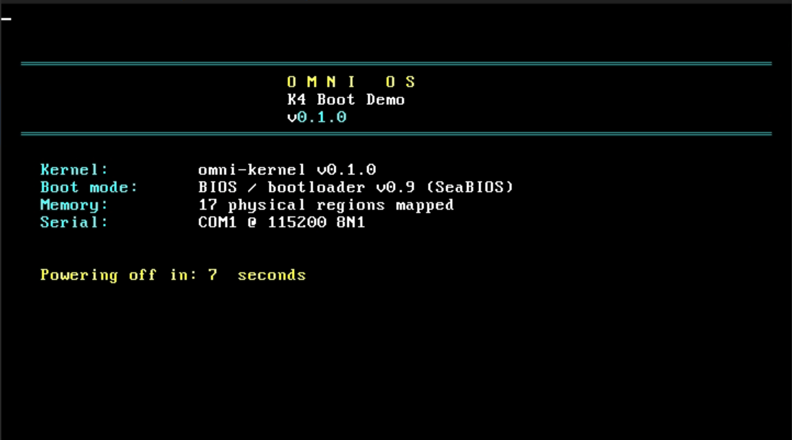

# OMNI OS

> An AI-native operating system. Local-first, privacy-by-construction, decentralized by design.

**Status:** Phase 1 (Microkernel POC) — `v0.3.0-alpha.1` released 2026-05-20 — **P0/P1/P2 closed**, **Track A desktop M1–M5 complete**, **Track B kernel MB1–MB14 cycle closed (MP up to cross-CPU context switch)**, **P6.7 user-space driver framework active** — OIP-013/014/015/016 all `Active`; sub-tasks P6.7.0–7 + P6.7.8.0–5 closed; next is P6.7.8.6 (e1000e M2 Ethernet driver bare-metal).

OMNI OS reimagines the operating system around AI as a first-class citizen. Inference, model orchestration, and intelligent agents are built into the kernel and runtime — not bolted on as cloud services. Privacy is enforced cryptographically, not by policy. The system can leverage other OMNI OS instances as a peer-to-peer compute mesh, scaling computational power collectively without depending on commercial AI providers.

---

## Vision

A globally adopted operating system that gives users the full power of modern AI without surrendering their data to centralized providers. Built for a generational lifetime (25+ years), targeting mainstream adoption.

## Core principles

1. **Local-first** — by default, nothing leaves the device.
2. **Privacy by construction** — the protocol enforces privacy cryptographically; trust is not granted, it is mathematically required.
3. **Decentralization as a means** — to achieve privacy and resist capture, not as an end in itself.
4. **Hardware-rooted security** — TEE attestation is mandatory for mesh participation.
5. **Open evolution** — protocol-compliant forks are first-class citizens.

## Documentation

All technical documentation lives in [`/docs`](./docs/README.md). Highlights:

- [Vision and principles](./docs/01-vision.md)
- [Architecture overview](./docs/02-architecture.md)
- [Mesh protocol](./docs/03-mesh-protocol.md)
- [Security model](./docs/04-security-model.md)
- [Governance](./docs/05-governance.md)
- [Roadmap](./docs/06-roadmap.md)
- [Hardware requirements](./docs/07-hardware-requirements.md)
- [Funding policy](./docs/08-funding-policy.md)
- [Tech specifications](./docs/09-tech-specifications.md)
- [Glossary](./docs/10-glossary.md)
- [Tooling & CI](./docs/11-tooling-and-ci.md)
- [Brand & visual identity](./docs/12-brand.md) — pointer to the [`/brand/`](./brand/) pack (strategy, voice, logos, palette, typography, icons, templates, [brand book PDF](./brand/OMNI-Brand-Book-v0.1.pdf))

## Project policies

- [Security policy & responsible disclosure](./SECURITY.md)
- [Contributing guide](./CONTRIBUTING.md) — DCO sign-off, Conventional Commits, PR workflow
- [Code of Conduct](./CODE_OF_CONDUCT.md) — Contributor Covenant v2.1
- [Commercial license terms](./COMMERCIAL-LICENSE.md) — placeholder pending Stichting OMNI

## Quick facts

| | |
|---|---|
| **Language** | Rust (2024 edition) |
| **Architecture** | Custom microkernel, written from scratch |
| **Initial hardware** | x86_64 with Intel TDX or AMD SEV-SNP |
| **Model architecture** | Mixture of Experts (MoE) |
| **License** | Dual: AGPL-3.0 + Commercial (via Stichting OMNI) |
| **Governance** | 3-layer: cryptographic protocol / federated specification / Stichting |

## Public commitments

These are commitments the project makes in writing, in versioned files under `main`, with
signed commits — not in marketing copy that can be quietly walked back.

- **BDFL veto window: 2026-05-09 → 2031-05-09 (immutable sunset, 23:59 UTC).** During this
  5-year window the founder can *block* `Standards Track` OIPs that break Layer 1 cryptographic
  guarantees, but cannot *impose* any OIP. The veto cannot be applied to `Process`,
  `Informational`, or `Meta` OIPs, and cannot be applied to a `Meta` OIP that narrows the
  founder's own authority. By that asymmetric clause, the window is **structurally
  non-extensible by founder action alone**: extending it requires a `Meta` OIP that itself
  cannot be vetoed and must pass the full quadratic-vote process. Authoritative source:
  [`OIP-Process-001` §5.4](./oips/oip-process-001.md). Cross-referenced in
  [`docs/05-governance.md`](./docs/05-governance.md) and the first commit on `main` (`61426d5`,
  signed).

- **OIPs are public domain (CC0-1.0).** The codebase is AGPL-3.0; the *protocol specifications*
  are released into the public domain so they can be quoted, mirrored, translated, and
  re-implemented without permission. Authoritative source:
  [`OIP-Process-001` §10](./oips/oip-process-001.md).

## Status

> **Graphical desktop demo — running on real hardware (VirtualBox + OVMF, 2026-05-16).**
> The kernel boots bare-metal via UEFI, renders a full interactive desktop (4 windows, live clock,
> PS/2 mouse + keyboard, terminal echo, system info), and powers off cleanly via ACPI S5.
> Physical-memory management, 4-level page-table walker, and IDT exception handlers are operational.



OMNI OS is currently in **Phase 1 (Microkernel PoC)**. The v0.1 design is complete, the foundational layer is implemented, the kernel bare-metal track has closed its MB1–MB14 cycle (including multi-CPU bring-up and cross-CPU context switching), and the user-space driver framework is in active implementation:

| Layer | Crates | State |
|---|---|---|
| Foundational | `omni-types`, `omni-crypto`, `omni-capability` | **Implemented** (P1 closed 2026-05-10) — `no_std + alloc`, RFC test vectors for every cryptographic primitive, `cargo clippy -D warnings` and `cargo doc -D warnings` clean. Postcard canonical wire format per `OIP-Serde-004`. |
| TEE root of trust | `omni-tee` | Trait surface + `MockTeeBackend` implemented (P5 scaffolding); concrete TDX / SEV-SNP backends land in P5. |
| **Kernel** | `omni-kernel` | **MB1–MB14 cycle closed (v0.3.0-alpha.1, 2026-05-20).** Boots bare-metal on x86_64 via UEFI (`bootloader` 0.11). **Track A complete:** GOP framebuffer, bitmap font, software cursor, PS/2 + VirtIO tablet, widget toolkit, desktop WM, RTC clock, ACPI S5 power-off, Build Info panel. **Track B complete:** frame allocator, page-table walker, IDT, SYSCALL/SYSRET, ELF64 loader, scheduler, LAPIC timer, Ring 3 + per-process CR3, IPC + multi-task, kernel-stack isolation, MP boot (AP INIT-SIPI live), TLB shootdown, per-CPU run queues, x2APIC, AP dispatch + cross-CPU context switch (MB14.h.2 + SCHED_LOCK). **P6.7 user-space driver framework active:** `MmioMap`/`DmaMap`/`IrqAttach` syscalls wired, virtio-net + NVMe driver scaffolds + bootable image siblings landed. |
| **Drivers (user-space)** | `omni-driver-net-virtio`, `omni-driver-nvme` (+ bootable `*-image` siblings) | **Scaffold + bring-up FSM** (P6.7.8.0–5). Library crates host the auditable bring-up state machines; workspace-excluded `*-image` sibling crates produce the bootable Ring 3 ELFs that `DriverLoad (73)` ingests. Real `MmioMap`/`DmaMap`/`IrqAttach` syscall wiring inside the image binaries is gated on the `DriverLoad` capability-deposit trampoline (P6.7.8.x). |
| HAL, services, user-facing | `omni-hal`, `omni-runtime`, `omni-mesh`, `omni-tokenization`, `omni-sdk`, `omni-agent`, `omni-shell` | Stubs. |

### Kernel milestone tracker (Phase 1, Track B)

| Milestone | Deliverable | Status |
|-----------|-------------|--------|
| MB1 | `BitmapFrameAllocator<N>` + GDT | ✅ 2026-05-16 |
| MB2 | x86_64 4-level page-table walker | ✅ 2026-05-16 |
| MB3 | IDT + `#DE` `#DF` `#GP` `#PF` handlers | ✅ 2026-05-16 |
| MB4 | Syscall dispatcher (`SYSCALL`/`SYSRET` + INT 0x80) | ✅ 2026-05-16 |
| MB5 | ELF64 loader (parser + segment mapper) | ✅ 2026-05-16 |
| MB6–MB9 | Scheduler, LAPIC preemption, VirtIO tablet, GOP demo | ✅ 2026-05-18 (v0.2.0) |
| MB10 | Kernel stack isolation | ✅ 2026-05-18 |
| MB11 | First Ring 3 process + per-process CR3 | ✅ 2026-05-18 |
| MB12 | IPC concrete + multi-task user-space | ✅ 2026-05-18 |
| MB13 | omni-capability integration | ✅ 2026-05-19 |
| MB14.a–h.2 | MP boot (AP INIT-SIPI live), TLB shootdown, per-CPU run queues, x2APIC, cross-CPU context switch | ✅ 2026-05-20 (v0.3.0-alpha.1) |
| P6.7.x | User-space driver framework + virtio-net + NVMe scaffolds & bootable image siblings | 🔄 P6.7.8.5 closed 2026-05-20; next P6.7.8.6 (e1000e M2) |

> **`omni-crypto` carries an `AWAITING_CRYPTO_REVIEW` marker.** The implementation follows established `RustCrypto`-family APIs with RFC test vectors for every primitive, but no external cryptographer has signed off yet (P3.2 in `/todo.md`, blocked on funding). Do not use the output of this crate in adversarial settings until that review lands.

Phase 0 also covers the legal and funding work (Stichting OMNI, Phase-0 grants — see P4 in `/todo.md`); these tracks run in parallel with the technical workstream.

See the [roadmap](./docs/06-roadmap.md) and [`/todo.md`](./todo.md) for the full backlog.

## License

Source code is released under the [GNU Affero General Public License v3.0](./LICENSE) by default.

Commercial licensing is available through Stichting OMNI for use cases incompatible with AGPL obligations. See [`COMMERCIAL-LICENSE.md`](./COMMERCIAL-LICENSE.md) and [funding policy](./docs/08-funding-policy.md).

## Reporting security issues

**Do not open public issues for security vulnerabilities.** Follow the procedure in [`SECURITY.md`](./SECURITY.md) — encrypted reports to `security@omni-os.org` (PGP fingerprint published once Stichting OMNI is constituted; fall back to `cySalazar@cySalazar.com` until then).

## Contributing

Read [`CONTRIBUTING.md`](./CONTRIBUTING.md) before opening a PR. Substantive proposals (protocol changes, breaking APIs, new TEE backends, governance changes) follow the [OMNI Improvement Proposal (OIP)](./oips/README.md) process, formalized in [`OIP-Process-001`](./oips/oip-process-001.md) (`Active` since 2026-05-10).

Local development quick-start:

```bash
cargo fmt --all -- --check
cargo clippy --workspace --all-targets -- -D warnings
cargo test --workspace --all-features
cargo deny check
```

CI enforces all of the above on every PR. See [Tooling & CI](./docs/11-tooling-and-ci.md) for the full enforcement matrix.

## Contact

- Project lead: cySalazar — `cySalazar@cySalazar.com`

---

*OMNI OS is a long-term effort. Stability of design comes before speed of delivery.*
